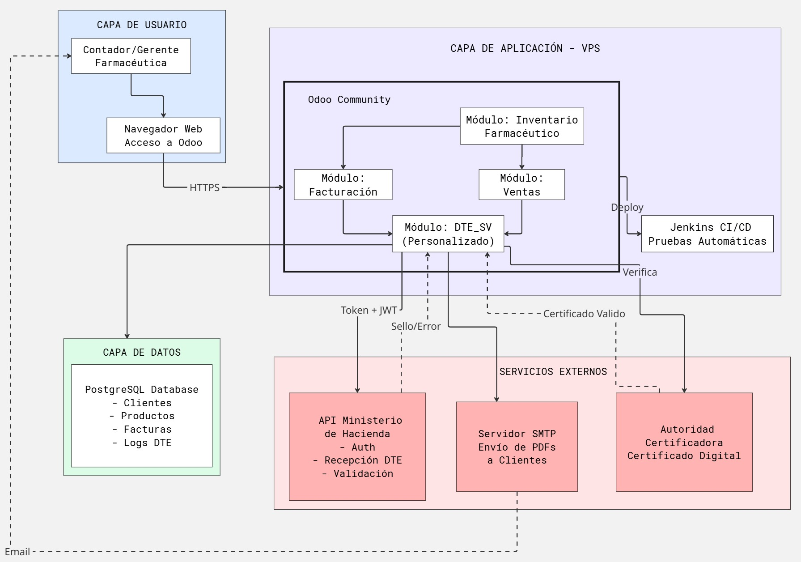
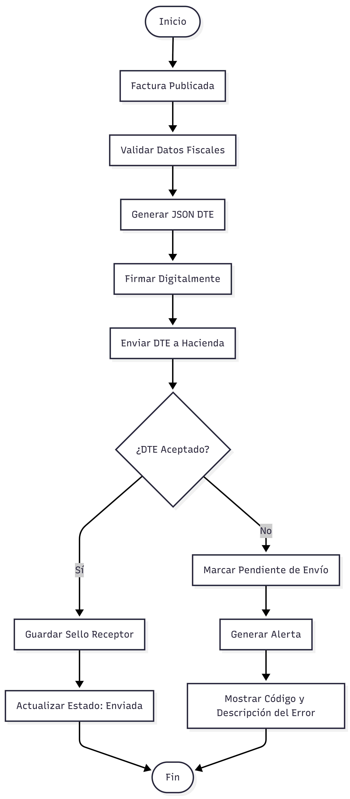
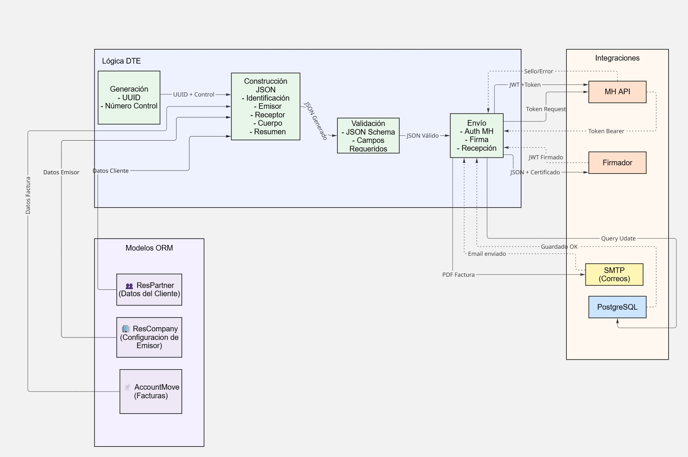
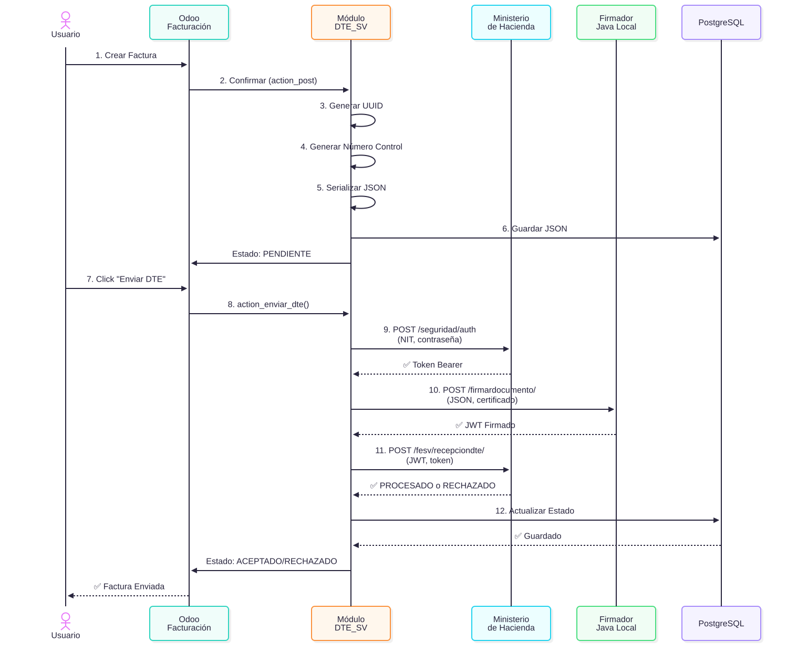

# Diagramas de Arquitectura y Casos de Uso

Diagramas visuales del sistema de facturación electrónica basados en los casos de uso CU-01, CU-02 y CU-03.

---

## 📊 Diagramas Disponibles

### 1. Arquitectura general

**Descripción**: Arquitectura del sistema en capas

**Muestra:**
- Capa de usuario: Navegador web
- Capa de aplicación: Odoo + módulos + Jenkins
- Capa de datos: PostgreSQL
- Servicios externos: MH, SMTP, Autoridad Certificadora

**Caso de uso**: CU-02 (servicios externos)

---

### 2. Flujo DTE

**Descripción**: Flujo completo de emisión de factura electrónica

**Proceso:**
- CU-01: Generación de factura (validación de campos)
- CU-02: Firma digital y envío a Ministerio de Hacienda
- CU-03: Consulta, seguimiento y reporte de estado

**Decisiones clave:**
- ✅ Si campos completos → Factura publicada
- ❌ Si error MH → Reintento hasta 3 veces
- ✅ Si aceptado → Estado ENVIADA + Sello

**Caso de uso**: CU-01, CU-02, CU-03

---

### 3. Diagrama de componentes y Relaciones

**Descripción**: Relaciones entre componentes principales

**Componentes:**
- Modelos ORM: account.move, res.company, res.partner
- Lógica DTE: generación, validación, envío
- Integraciones: MH, Firmador, PostgreSQL

**Caso de uso**: Todos (visión holística)

---

### 4. Diegrama de Secuencia

**Descripción**: Secuencia detallada del envío a MH (CU-02)

**Pasos temporales:**
1. Generar UUID y número control
2. Serializar a JSON/DTE
3. Autenticarse en MH (Token)
4. Firmar con Firmador Java (JWT)
5. Enviar a MH API
6. Procesar respuesta (PROCESADO/RECHAZADO)
7. Generar PDF
8. Enviar por correo

**Caso de uso**: CU-02 (detalle paso a paso)

---

---

## 🔗 Referencias

- [Arquitectura Inicial](../arquitectura-inicial.md) — Stack tecnológico
- [Documentación Técnica](../documentacion-tecnica.md) — Implementación

---

**Última actualización**: 2026-06-02  
✅ **Estado**: Todos los 4 diagramas completos
