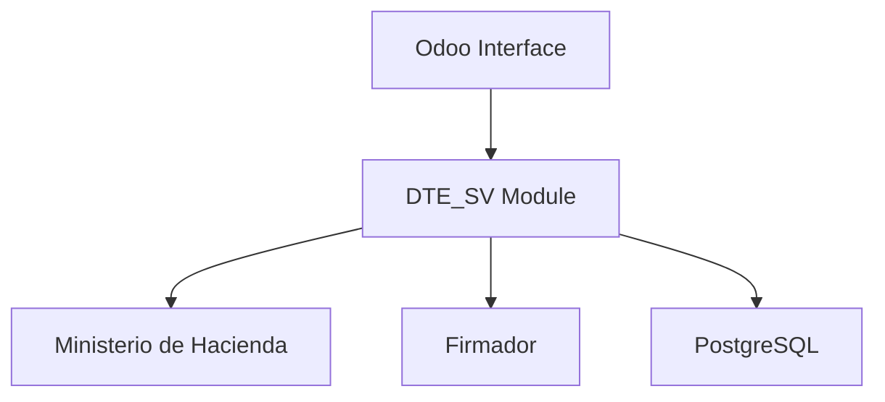

# Diagramas de Arquitectura

Esta carpeta contiene diagramas visuales del sistema de facturación electrónica.

## Contenido

### 1. arquitectura-general.png
**Descripción**: Diagrama de capas y componentes del sistema

Muestra:
- Layer 1: Interfaz Web Odoo
- Layer 2: Módulo DTE_SV (modelos, lógica)
- Layer 3: Servicios externos (MH, Firmador, BD)
- Puertos y conexiones

### 2. flujo-dte.png
**Descripción**: Ciclo completo de facturación electrónica

Flujo:
1. Creación de factura
2. Confirmación (generación de UUID, número control)
3. Validación schema
4. Firma digital
5. Envío a MH
6. Actualización de estado

### 3. componentes.png
**Descripción**: Relaciones entre componentes principales

Muestra:
- Modelo: account.move
- Modelo: res.company
- Modelo: res.partner
- Integraciones externas
- Flujo de datos entre componentes

## Generar Diagramas

Los diagramas pueden generarse desde:

- **Mermaid**: Usar formato `.mmd` y renderizar en GitHub
- **PlantUML**: Usar formato `.plantuml`
- **Draw.io**: Exportar a PNG desde draw.io
- **Lucidchart**: Exportar a PNG desde Lucidchart

### Plantilla Mermaid (ejemplo)

## Actualizar Diagramas

Para mantener los diagramas actualizados:
1. Editar el diagrama en la herramienta correspondiente
2. Exportar a PNG con resolución 1920x1080
3. Reemplazar archivo en esta carpeta
4. Hacer commit y push

---

**Nota**: Estos diagramas son complementarios a la documentación textual en:
- [Arquitectura Inicial](../arquitectura-inicial.md)
- [Documentación Técnica](../documentacion-tecnica.md)
